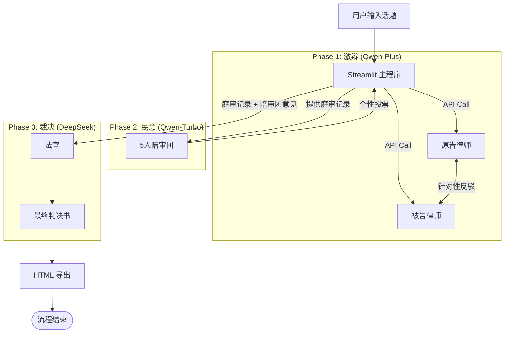
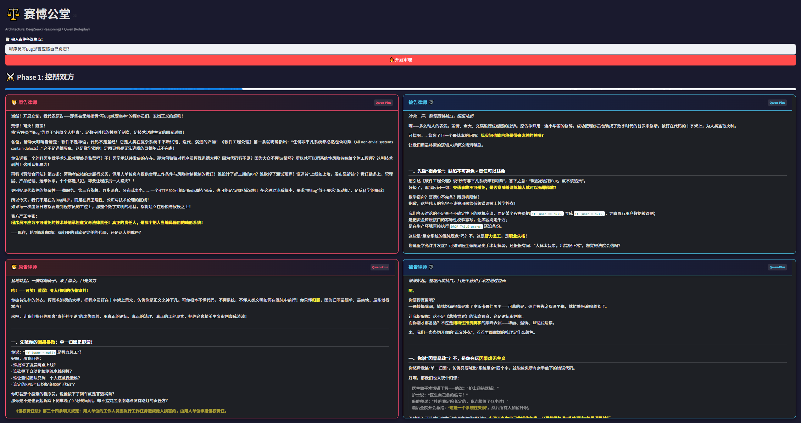
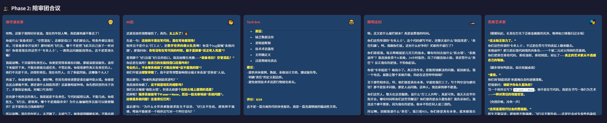
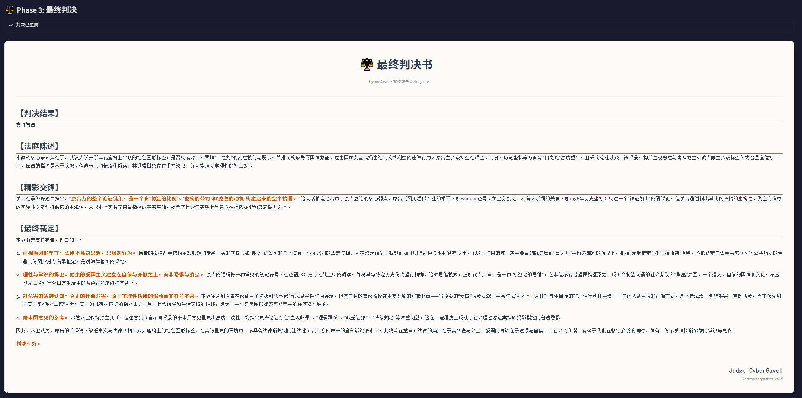

# ⚖️ CyberGavel | 赛博公堂

   
**CyberGavel** 是一个基于 Streamlit 的 AI 模拟法庭系统。它利用多智能体（Multi-Agent）协作架构，让agent分别扮演**律师**、**陪审团**和**法官**，针对用户输入的争议话题进行实时辩论、投票并生成判决书。
## ✨ 项目亮点

* **🧠 多模型混合架构 (Model Routing)**：
    * **法官 (Judge)**：由 **DeepSeek-V3** 驱动，负责深度逻辑推理、权衡利弊及最终裁决。
    * **律师 (Lawyers)**：由 **Qwen-Plus (通义千问)** 驱动，擅长逻辑攻防、引用法条及激进辩论。
    * **陪审团 (Jury)**：由 **Qwen-Turbo** 驱动，低成本模拟多种人类性格，反应真实舆论。
* **🎭 沉浸式角色扮演**：内置 5 种性格迥异的陪审团画像（玩梗 00 后、保守长辈、极客 Tech Bro、富二代、艺术家），模拟真实的社会舆论环境。
* **⚔️ 动态辩论系统**：支持自定义辩论回合数，控辩双方会根据上一轮的发言内容进行针对性反驳（Context-Aware）。
* **📄 判决书导出**：自动生成排版精美的 HTML 判决书，支持一键下载，离线查看依然保持样式。
* **🎨 精致 UI 设计**：深度定制 Streamlit ，打造深色模式下的沉浸式法庭体验。

## 🏗️ 系统架构


## 📂 文件结构说明

```text
CyberGavel/
├── main.py           # 🚀 程序入口：控制辩论流程、UI布局与交互逻辑
├── config.py         # ⚙️ 模型配置：定义 DeepSeek 和 Qwen 的 API 路由
├── prompts.py        # 📝 提示词库：定义律师指令、陪审团人设 (System Prompts)
├── styles.py         # 🎨 样式文件：自定义 CSS、Markdown 转 HTML 渲染逻辑
├── utils.py          # 🛠️ 工具函数：封装 OpenAI 客户端调用与错误处理
├── requirements.txt  # 📦 项目依赖
└── .env              # 🔑 API 密钥 (需自行创建，不要上传到 GitHub)
```

## 🚀 快速开始
### 1. 克隆项目

```bash
git clone https://github.com/ht426/CyberGavel.git
cd CyberGavel
```

### 2. 安装依赖
```bash
pip install -r requirements.txt
```
### 3. 配置环境变量
```bash
# .env 文件
# 1. 用于法官 (DeepSeek)
DEEPSEEK_API_KEY="sk-xxxxxxxxxxxxxxxxxxxxxxxxxxxxxxxx"
# 2. 用于律师和陪审团 (阿里云 DashScope)
DASHSCOPE_API_KEY="sk-xxxxxxxxxxxxxxxxxxxxxxxxxxxxxxxx"
```
### 4. 运行应用
```bash
streamlit run main.py
```

## 效果展示
### 1. 控辩双方交锋
律师会自动根据对方的观点进行反驳，支持 Markdown 格式输出。

### 2. 陪审团动态投票
5 位不同人设的陪审员会实时发表个性化评论。

### 3. 最终判决书
法官综合各方意见，输出结构化判决书，并提供精美的 HTML 下载版。


## 可扩展方向
### 1. ⚖️ 引入 RAG (检索增强生成) - 真实法律支持
### 2. 🕵️ 证据生成系统 (多模态)
### 3. 🔄 动态质询环节 (Cross-Examination)
### 4. 🗣️ 语音合成 (TTS) - 沉浸式庭审
### 5. 📊 实时舆情图表

## 📝 许可证
### 本项目采用MIT许可证。

欢迎大家基于此项目进行探索和贡献！
