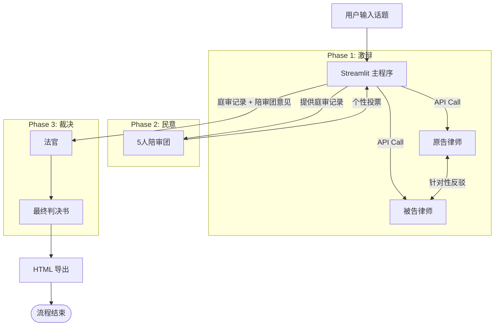

# ⚖️ CyberGavel | 赛博公堂


     

**CyberGavel** 是一款基于 Streamlit 构建的多智能体（Multi-Agent）AI 模拟法庭系统。系统采用可扩展的多模型协作架构，支持接入多种主流大语言模型（如 DeepSeek、Qwen、GLM、Kimi 等），并通过角色分工让各 Agent 分别担任律师、陪审团与法官。系统能够围绕用户给定的争议议题开展实时辩论、立场对抗与推理协作，结合陪审团模拟投票机制生成最终裁决，并自动生成结构化、可导出的判决书。

* **🧠 多模型混合架构 (Model Routing)**：
    * **法官 (Judge)**：承担高复杂度逻辑推理、证据权衡与最终裁决生成，确保判断过程的严谨性与一致性。
    * **律师 (Lawyers)**：擅长开展结构化的逻辑攻防，通过严密推理构建有力论证，并依据辩论情境主动采取更具进攻性的辩论策略。
    * **陪审团 (Jury)**：以轻量化模型模拟多类人群画像，实现低成本、多样化的舆论反馈，提升系统对社会观点的拟真度。
* **🎭 沉浸式角色扮演**：内置 5 种性格迥异的陪审团画像（玩梗 00 后、保守长辈、极客 Tech Bro、富二代、艺术家），模拟真实的社会舆论环境。
* **⚔️ 动态辩论系统**：支持自定义辩论回合数，控辩双方会根据上一轮的发言内容进行针对性反驳（Context-Aware）。
* **📄 判决书导出**：自动生成排版精美的 HTML 判决书，支持一键下载，离线查看依然保持样式。
* **🎨 精致 UI 设计**：深度定制 Streamlit ，打造深色模式下的沉浸式法庭体验。

## 🏗️ 系统架构



## 📂 文件结构说明

```text
CyberGavel/
├── main.py           # 🚀 程序入口：控制辩论流程、UI布局与交互逻辑
├── config.py         # ⚙️ 模型配置：定义 DeepSeek、Qwen、Kimi、Glm 的 API 路由
├── prompts.py        # 📝 提示词库：定义律师指令、陪审团人设 (System Prompts)
├── styles.py         # 🎨 样式文件：自定义 CSS、Markdown 转 HTML 渲染逻辑
├── utils.py          # 🛠️ 工具函数：封装 OpenAI 客户端调用与错误处理
├── requirements.txt  # 📦 项目依赖
└── .env              # 🔑 API 密钥 (需自行创建，不要上传到 GitHub)
```

## 🚀 快速开始
### 1. 克隆项目

```bash
git clone https://github.com/ht426/CyberGavel.git
cd CyberGavel
```

### 2. 安装依赖
```bash
pip install -r requirements.txt
```
### 3. 配置环境变量
```bash
# .env 文件
# 1. DeepSeek
DEEPSEEK_API_KEY="sk-xxxxxxxxxxxxxxxxxxxxxxxxxxxxxxxx"
# 2. 阿里云 DashScope
DASHSCOPE_API_KEY="sk-xxxxxxxxxxxxxxxxxxxxxxxxxxxxxxxx"
# 3. Kimi
MOONSHOT_API_KEY="sk-xxxxxxxxxxxxxxxxxxxxxxxxxxxxxxxx"
# 4. GLM
ZHIPU_API_KEY="sk-xxxxxxxxxxxxxxxxxxxxxxxxxxxxxxxx"
```
### 4. 运行应用
```bash
streamlit run main.py
```

## 效果展示
### 1. 控辩双方交锋
律师会自动根据对方的观点进行反驳，支持 Markdown 格式输出。

### 2. 陪审团动态投票
5 位不同人设的陪审员会实时发表个性化评论。

### 3. 最终判决书
法官综合各方意见，输出结构化判决书，并提供精美的 HTML 下载版。


## 可扩展方向
1. ⚖️ 引入 RAG (检索增强生成) - 真实法律支持
2. 🕵️ 证据生成系统 (多模态)
3. 🔄 动态质询环节 (Cross-Examination)
4. 🗣️ 语音合成 (TTS) - 沉浸式庭审
5. 📊 实时舆情图表

## 📝 许可证
本项目采用MIT许可证。

欢迎大家基于此项目进行探索和贡献！
